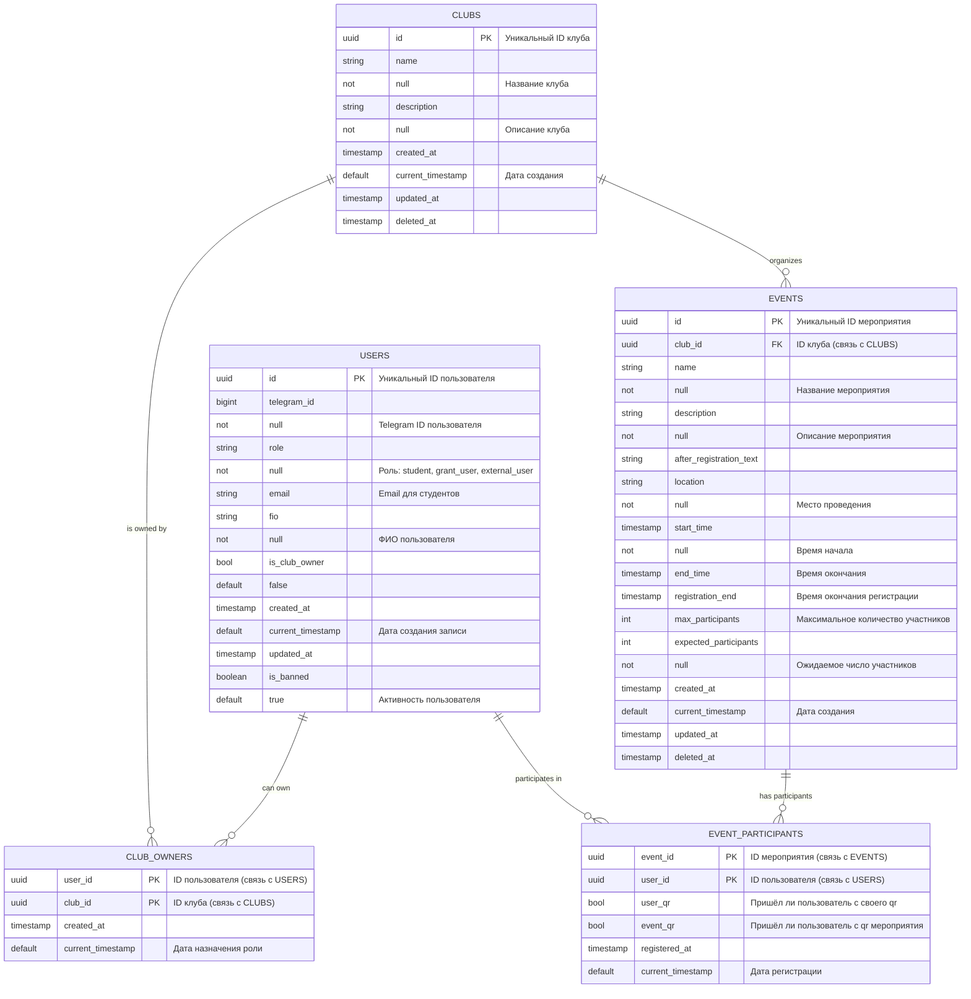

# Бот для клубов

## Todo
- подключить линтер
- накидать структуру Golang проетка для тг-бота
- схему бд и бота сюда залить 

[Схема бота](https://miro.com/welcomeonboard/NnB1K3UwMHg4TEIrWUFkRkwyT2ZlRDI5dW5WSm8xeVltNlNIWFp0b055a3lVVm5SY2t5TENEWFZsNTVMVUxxalp4V256dlA0SnBRbEQxQ2YxcmZVSHI4UXQ4TkQ1d3hQMjlqWmQwZi9DTHBNeWZJaVdvU0pJSGErNytVZDJ0amkhZQ==?share_link_id=868943904438)

Схема БД

